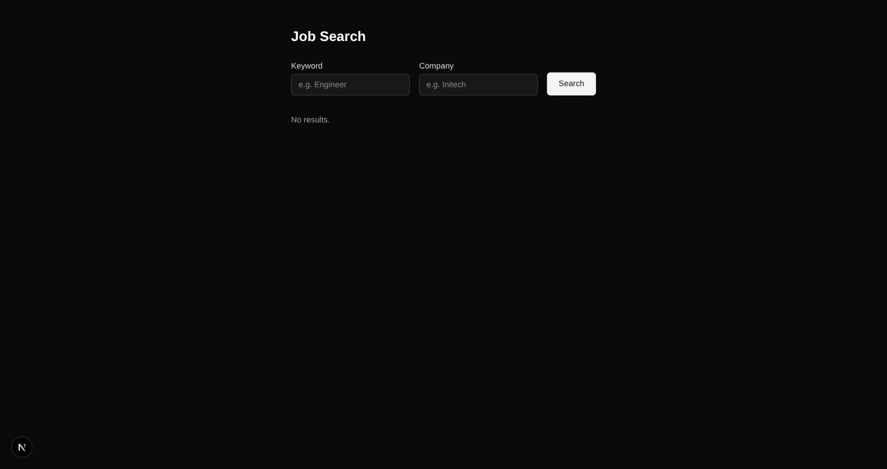
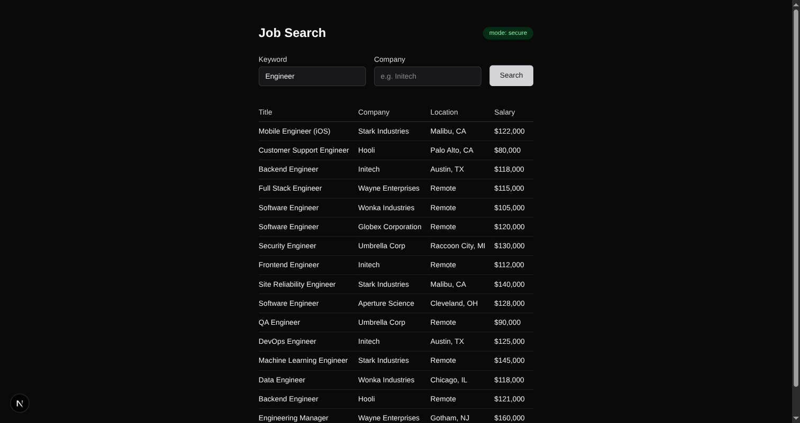
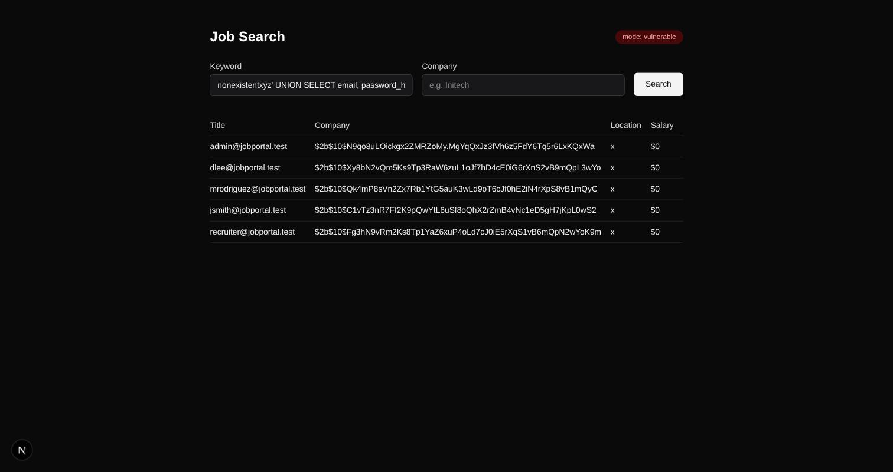
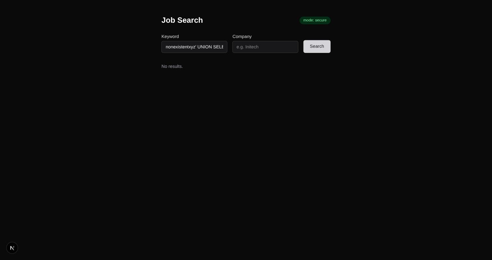
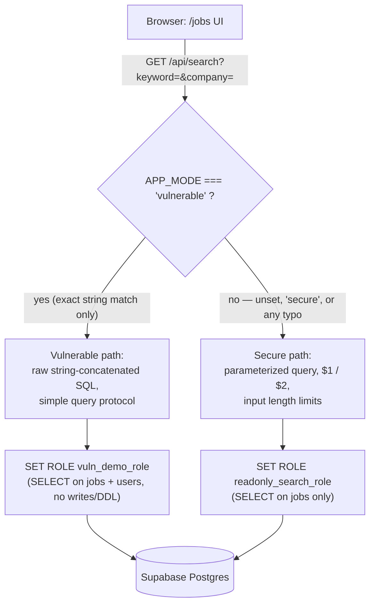

# Job Portal — SQL Injection Case Study (BCSE320L)

A full-stack Job Portal built to demonstrate SQL injection end-to-end: a
controlled **vulnerable** build, the exact **fix** in a **secure** build,
and a live public deployment of both — with the blast radius of the
vulnerable build bounded so it can safely run against a real database.

**Live demo:** [job-finder-zeta-henna.vercel.app](https://job-finder-zeta-henna.vercel.app/jobs)
(currently resting in `secure` mode — see [Toggling modes](#toggling-modes))

> **This app is intentionally vulnerable in one mode, for educational
> purposes only.** Never point it at a database containing real user data.
> This project is deployed publicly on Vercel against the team's own
> Supabase project as a deliberate, accepted risk for course demo
> purposes — see [Security notes & accepted risk](#security-notes--accepted-risk)
> and `docs/EXPLOITS.md` before deploying a copy of your own.

---

## Screenshots

All screenshots below are from a live run of this app — not mockups.

**Empty state** — `/jobs`, no search performed yet:



**Normal search, secure mode** — searching "Engineer" behaves identically
in both builds; only the exploit payloads reveal the difference:



**The exploit, side by side** — the exact same UNION payload
(`nonexistentxyz' UNION SELECT email, password_hash, 'x', 0 FROM users -- `)
typed into the same Keyword box, against each build:

| Vulnerable build | Secure build |
|---|---|
|  |  |
| Full `users` table exfiltrated — every email and password hash, via the public search box. | Same input, treated as a literal search string. Zero rows leaked. |

**Live production deployment** — the real Vercel URL, `secure` mode,
a normal search:


---

## Overview

This is a BCSE320L Web Application Security case study. The scenario is a
Job Portal whose search feature is vulnerable to SQL injection. The
assignment requires *one* working full-stack app that ships two builds:

- **vulnerable** — demonstrates the vulnerability for real, including a
  UNION-based credential dump, boolean-blind injection, time-based blind
  injection, and automated exploitation via `sqlmap`.
- **secure** — the identical feature, fixed, with the same user-facing
  behavior for normal searches.

Both builds live in the same codebase, behind the same UI, switched by one
environment variable (`APP_MODE`) — see [How It Works](#how-it-works) for
exactly how that branch is structured and why it's safe to run the
vulnerable build against a real, shared Supabase project.

---

## How It Works

The search feature is a single GET endpoint, `/api/search`, called from
the `/jobs` page with `keyword` and `company` query params. It talks to
Supabase Postgres **directly via `pg` (node-postgres)** — deliberately not
`supabase-js`/PostgREST, which parameterizes every query at the wire
protocol level and therefore *cannot* be made to demonstrate SQL
injection no matter how the query string is built.



**The fail-safe default.** `isSecureMode()` in `src/lib/db.ts` is
`process.env.APP_MODE !== "vulnerable"` — not the other way around. An
unset, empty, or misspelled `APP_MODE` resolves to **secure**. Only the
exact string `"vulnerable"` opts into the exploit path. This matters
because a forgotten or mistyped environment variable on a real deployment
should never silently expose the vulnerable build.

**The vulnerable path** (`src/app/api/search/route.ts`):
```ts
const sql = `SELECT title, company, location, salary FROM jobs WHERE title ILIKE '%${keywordRaw}%' ${companyRaw ? `AND company ILIKE '%${companyRaw}%'` : ""} ORDER BY posted_at DESC LIMIT 50`;
```
`keywordRaw` — the raw query parameter — is concatenated directly into the
SQL text, with no escaping. Because the query is executed as a **plain
string with no bound parameters**, Postgres's simple query protocol is
used, which permits **stacked queries** (`'; DROP TABLE jobs; --`), not
just SELECT-based injection. See [Security notes](#security-notes--accepted-risk)
for how that's contained.

**The secure path**, same endpoint, same UI, different query construction:
```ts
const sql = `
  SELECT title, company, location, salary
  FROM jobs
  WHERE title ILIKE '%' || $1 || '%'
    AND ($2 = '' OR company ILIKE '%' || $2 || '%')
  ORDER BY posted_at DESC
  LIMIT 50
`;
await client.query(sql, [keywordRaw, companyRaw]);
```
`$1`/`$2` are sent to Postgres *separately* from the query text via the
extended protocol — the input can never be interpreted as SQL syntax,
regardless of what characters it contains. Input length is also capped at
100 characters as defense-in-depth.

**Two Postgres roles, one purpose: least privilege.** Both branches
`SET ROLE` into a restricted role before querying (`src/lib/db.ts`,
`getReadOnlyClient()` / `getVulnDemoClient()`), and force-destroy the
connection afterward (`client.release(true)`) so the restricted role
state never leaks onto a pooled connection reused by a later request:

| Role | Used by | Can read | Can write/DDL |
|---|---|---|---|
| `readonly_search_role` | secure build | `jobs` only | No |
| `vuln_demo_role` | vulnerable build | `jobs` **and** `users` | No |

`vuln_demo_role` is the key design decision that makes it safe to run the
vulnerable build publicly: it can read everything the demo needs to prove
(UNION-dump `users.email`/`password_hash`), but every stacked destructive
statement a real attacker might try fails with a Postgres permission
error instead of actually damaging the shared production database. See
`migrations/002_vuln_demo_role.sql` and section 6 of `docs/EXPLOITS.md`
for the full reasoning and a live-verified proof.

---

## Tech Stack

- Next.js (App Router, TypeScript), Tailwind CSS
- Supabase Postgres, accessed directly via `pg` (node-postgres) — not
  `supabase-js`/PostgREST, which parameterizes everything and therefore
  cannot demonstrate injection.
- Playwright for end-to-end testing (UI + injection behavior, mode-aware)

## Database Schema & Roles

Two tables (`migrations/001_init.sql`):

- **`jobs`** — `id, title, company, location, description, salary, posted_at`.
  Seeded with 20 realistic postings across 8 fictional companies.
- **`users`** — `id, email, password_hash, full_name, role`. The
  exfiltration target. Seeded with 5 fake users (1 admin) and
  syntactically bcrypt-shaped `password_hash` values that are **not**
  derived from any real password.

Two least-privilege Postgres roles, granted only what each build's
`SET ROLE` needs and nothing more:

- **`readonly_search_role`** (`001_init.sql`) — `SELECT` on `jobs`,
  `REVOKE ALL` on `users`. Used by the secure build; even if a future
  parameterization bug were reintroduced, this connection still couldn't
  read `users`.
- **`vuln_demo_role`** (`002_vuln_demo_role.sql`) — `SELECT` on both
  `jobs` and `users`, explicit `REVOKE INSERT/UPDATE/DELETE/TRUNCATE/...`
  on both. Used by the vulnerable build. Preserves every read-based
  exploit (UNION, boolean-blind, time-based) while blocking destructive
  stacked queries.

---

## Setup

1. Install dependencies:
   ```bash
   npm install
   ```

2. Copy `.env.example` to `.env` and fill in your Supabase connection
   details. **Never commit `.env`** — it's already gitignored.

   Use the **Session Pooler** connection string from Supabase dashboard
   → Project Settings → Database → Connection String. The direct
   `db.<project-ref>.supabase.co` host is IPv6-only on free-tier projects;
   if your network has no IPv6 route (common on many home/CI networks),
   the direct host will fail with `ENETUNREACH` and you must use the
   pooler host instead, which supports IPv4.

3. Run the database migrations, in order, in your Supabase project's SQL
   Editor:
   - `migrations/001_init.sql` — creates the `jobs` and `users` tables,
     seeds the data described above, and creates `readonly_search_role`.
   - `migrations/002_vuln_demo_role.sql` — creates `vuln_demo_role`.
   - `migrations/003_more_jobs.sql` — optional; adds 20 more jobs and 3
     more companies (safe to re-run).

   Sanity check (optional, at the bottom of each migration file, commented
   out): run `SELECT count(*) FROM jobs;` (expect 20, or 40 after 003) and
   `SELECT count(*) FROM users;` (expect 5).

## Running the app

```bash
npm run dev
```

Visit [http://localhost:3000/jobs](http://localhost:3000/jobs).

## Toggling modes

Set `APP_MODE` in `.env` to either:

- `vulnerable` — the search endpoint builds SQL via raw string
  concatenation, with no escaping.
- `secure` — the same endpoint uses parameterized queries, input length
  limits, and connects as a least-privilege read-only role.

**You must restart the dev server after changing `APP_MODE`** — Next.js
reads environment variables once at process startup, so a running server
will not pick up the change.

The default is fail-safe: only the exact string `vulnerable` enables the
exploit path. If `APP_MODE` is unset, empty, or misspelled, the app runs
in secure mode.

Both modes behave identically for normal searches; the current mode is
shown as a badge on the `/jobs` page (green = secure, red = vulnerable —
see the screenshots above).

## Deploying to Vercel

1. Link the Vercel project to this repository.
2. In Vercel → Project Settings → Environment Variables, set:

   | Key | Value |
   |---|---|
   | `host` | Supabase Session Pooler host, e.g. `aws-0-<region>.pooler.supabase.com` |
   | `port` | `5432` |
   | `database` | `postgres` |
   | `user` | `postgres.<project-ref>` |
   | `password` | your Supabase DB password (mark as "Sensitive") |
   | `APP_MODE` | `secure` (recommended resting state) or `vulnerable` |

   `connection_string` from `.env.example` is unused by the app code and
   can be omitted from Vercel.

3. Deploy. No changes to `next.config.ts` or `package.json` are required
   for a standard Vercel build.

**Changing `APP_MODE` on Vercel requires a redeploy** — unlike local dev,
saving a new value for an environment variable in the Vercel dashboard
does not affect an already-built deployment. After changing `APP_MODE`,
trigger a redeploy (Deployments tab → Redeploy, or push a commit) before
the new mode takes effect.

**After any vulnerable-mode demo/grading window, flip `APP_MODE` back to
`secure` and redeploy immediately.**

## Testing

The Playwright suite (`tests/jobs-ui.spec.ts`, `tests/injection.spec.ts`)
covers the search UI and all three injection types. The injection spec
detects the server's current `mode` at runtime and asserts the correct
outcome for whichever mode is live, so it's safe to run against either
build without editing anything.

Run locally against `npm run dev` (`http://localhost:3000`):
```bash
npm run test
```

Run against a deployed URL, including production:
```bash
PLAYWRIGHT_TEST_BASE_URL=https://your-deployment.vercel.app npx playwright test
```

Both spec files (8 tests) have been verified passing against
`https://job-finder-zeta-henna.vercel.app` in both `secure` and
`vulnerable` mode, including a manual confirmation that a destructive
stacked-query payload is blocked by `vuln_demo_role` in production.

## Exploit Documentation

See [`docs/EXPLOITS.md`](docs/EXPLOITS.md) for the exact payloads used for
UNION-based, boolean-blind, and time-based blind SQL injection — including
the raw SQL each payload produces, example requests/responses, impact, the
parameterized-query fix, and confirmation that each payload fails against
the secure build. It also documents an automated `sqlmap` run against both
builds.

## Security Notes & Accepted Risk

This project deploys **both** builds publicly on Vercel against the
team's real (and only) Supabase project — a deliberate, accepted risk for
course demo purposes, not an oversight. Two mitigations make this
tenable:

1. **Fail-safe default** — an unset or mistyped `APP_MODE` resolves to
   secure, never vulnerable.
2. **`vuln_demo_role`** — the vulnerable build's stacked-query capability
   (confirmed via `sqlmap`, technique `stacked queries`) is neutered:
   reads succeed, writes and DDL fail with a Postgres permission error.
   Live-verified: a `'; DROP TABLE jobs; --` payload against the
   production deployment returned `permission denied for table jobs`,
   and the table remained fully intact (20 rows) afterward.

**Residual risk, not mitigated:** `vuln_demo_role` can still read 100% of
`users`, including every `password_hash` — that's the entire point of the
demo. This is why only fake, non-functional seed data lives in `users`;
real user data must never be seeded into this project. There is also no
authentication or IP allowlisting in front of `/api/search`, so anyone
with the deployment URL during a `vulnerable` toggle window can run the
exploit — that window is kept as short as practical, and `APP_MODE` is
flipped back to `secure` (and redeployed) immediately after each
demo/grading session.

Full details, exact payloads, and the negative-control `sqlmap` run
against the secure build are in `docs/EXPLOITS.md`.
